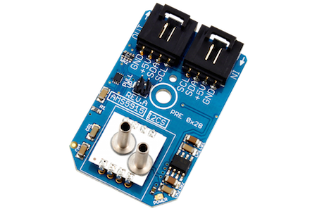

[](https://www.controleverything.com/products)
# AMS5915_0100_D
AMS5915_0100_D Digital Pressure and Temperature Sensor

The AMS5915_0100_D is a combined pressure and temperature sensor.

This Device is available from ControlEverything.com [SKU: AMS5915_I2CS_0100-D]

https://www.controleverything.com/products

This Sample code can be used with Raspberry pi, Arduino, Particle and Beaglebone Black.

## Java
Download and install pi4j library on Raspberry pi. Steps to install pi4j are provided at:

http://pi4j.com/install.html

Download (or git pull) the code in pi.

Compile the java program.
```cpp
$> pi4j AMS5915_0100_D.java
```

Run the java program.
```cpp
$> pi4j AMS5915_0100_D
```

## Python
Download and install smbus library on Raspberry pi. Steps to install smbus are provided at:

https://pypi.python.org/pypi/smbus-cffi/0.5.1

Download (or git pull) the code in pi. Run the program.

```cpp
$> python AMS5915_0100_D.py
```

## Arduino
Download and install Arduino Software (IDE) on your machine. Steps to install Arduino are provided at:

https://www.arduino.cc/en/Main/Software

Download (or git pull) the code and double click the file to run the program.

Compile and upload the code on Arduino IDE and see the output on Serial Monitor.


## Particle Photon

Login to your Photon and setup your device according to steps provided at:

https://docs.particle.io/guide/getting-started/connect/photon/

Download (or git pull) the code. Go to online IDE and copy the code.

https://build.particle.io/build/

Verify and flash the code on your Photon. Code output is shown in logs at dashboard:

https://dashboard.particle.io/user/logs

## C

Download (or git pull) the code in Beaglebone Black.

Compile the c program.
```cpp
$>gcc AMS5915_0100_D.c -o AMS5915_0100_D
```
Run the c program.
```cpp
$>./AMS5915_0100_D
```
#####The code output is the pressure in mbar and temperature reading in degree celsius and fahrenheit.
